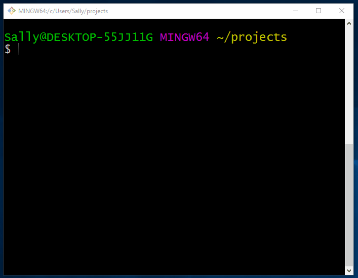
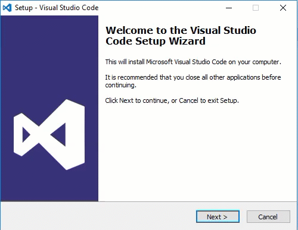
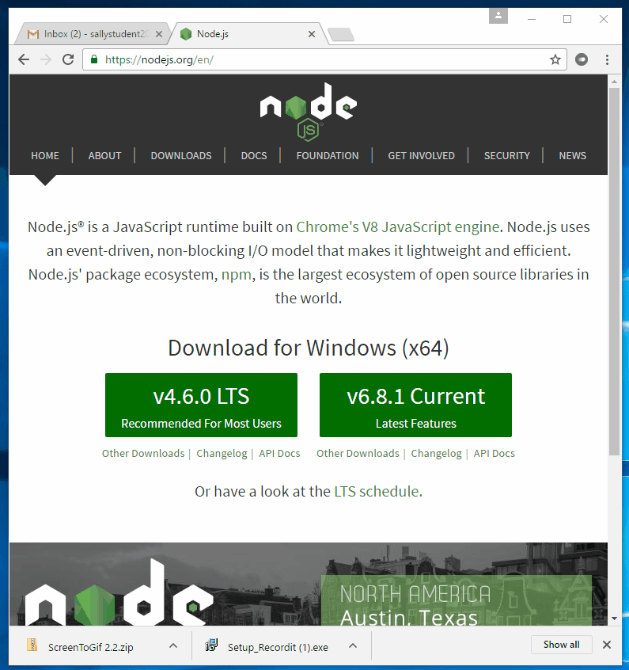
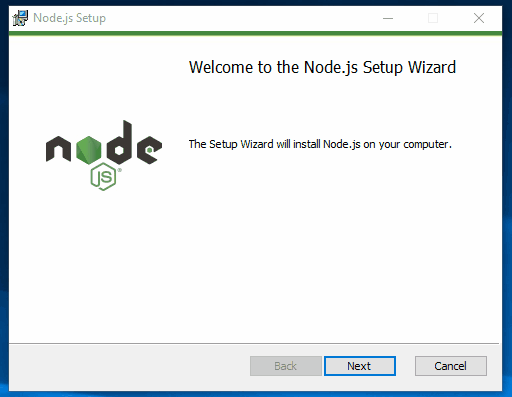

In this reading we'll guide you through setting up your local development environment for Windows. First, we'll install Git Bash (which is part of [Git for Windows](https://git-for-windows.github.io/)), which gives us a Linux-like command-line environment in Windows.

After configuring Git, we'll install and configure Visual Studio Code so we can open folders and files directly from the command line. Finally, we'll install Node and NPM.

###### This guide assumes you're on Windows 10. If you're on an earlier version, consider upgrading to Windows 10. If that's not possible, please let your mentor know as soon as possible, and you can decide on an alternative solution like [Cloud9](https://c9.io).

### Install Git Bash

We'll use Git Bash for local development of all our projects in this course. Let's get started!

First, verify that you've got the most recent release of Windows and update if not.

Now, we need to activate developer mode in Settings. Open Settings (by typing "settings" in Cortana at the bottom left of your screen) and choose "Update & Security" then "For developers", and then turn on "Developer mode" if it's not already selected.

Note that you may be prompted to install additional packages (and you should do this if prompted) and a restart may be required (which you should also do).

Now we need to download and install [Git for Windows](https://git-for-windows.github.io/). The installer will prompt you through several setup screens. You should select the default option for each one, with the exception of the "Select components" screen, where you may opt to add a Git Bash Icon to your desktop.

Once the installation has finished, you can open Git for Bash by clicking on Cortana and typing "Git Bash"). You've now got a Linux-like command line environment running in Windows. If you need a refresher on command line basics, [this resource is a good starting point](http://www.howtogeek.com/140679/beginner-geek-how-to-start-using-the-linux-terminal/).

Before moving on, be sure to configure your Git username and email address. From a Git Bash terminal, run `git config --global user.name "Sally Student"` (substituting your user name), and then `git config --global user.email "sallystudent2017@gmail.com"` (substituting your email address).

### Set up Visual Studio Code

If you don't already have it installed, [download Visual Studio Code](https://code.visualstudio.com/). If you prefer a different text editor, that's fine, but configuration will be up to you.

Again, the installer will prompt you through several setup screens. You should select the default option for each one, with the exception of the "Add Open with Code action to Windows Explorer" screen, where you may opt to add "Open with Code" to the context menus.

Typically when you start a new coding session, you'll `cd` into your project directory from terminal and open your project in your editor by running `code .`. To confirm that the command works correctly. Open a Git Bash terminal, `cd My\ Documents\` and then run `code `. If it is configured correctly, Visual Studio Code will open your "My Documents" folder.

### Install and configure Node and NPM

Up next we're going to install [Node](https://nodejs.org/en/), which comes with [NPM](https://www.npmjs.com/).

First, you'll need to download the Node installer, which is available [here](https://nodejs.org/en/). Be sure to download the "Latest features" version.

After the installer downloads, double click on it to start the installation. In the setup interface, click OK for each of the default options.

After the installation completes, run the command `node --version` from a new Git Bash window to confirm the installation. You should see something like `6.7.0`.

Next, let's confirm that we can run a Node application in this environment. Inside of Git Bash, `cd` into your project folder (if you don't already have one, create a folder to store the projects you create for this course) and create a new folder called `hello_node` by running the command `mkdir hello_node` and then moving into this folder (`cd hello_node`).

Now, let's create a simple Node application. Run this command: `echo "console.log('hello world');" > hello.js`. This will create a new file (`~/hello_node/hello.js`) with a single `console.log('hello world');` command in it (you can confirm this by running `cat hello.js`).

`cd` into `hello_node` and then run the command `node hello.js`. You should see the message "hello world" printed to the terminal window.

`cd` back into your project folder (`cd ..`) and delete the folder we just created (`rm -r hello_node`).

###### Be careful with this command; it will delete an entire folder without confirmation. Experienced users often add a confirmation prompt to this command as a safeguard against errors.

Before moving on, let's confirm that we can get an Express app running locally.

To do that we're first going to install [Express generator](https://www.npmjs.com/package/express-generator), which is a third-party package that allows us to quickly bootstrap a new Express project.

Run the command `npm install -g express-generator`. Once Express Generator has installed, use it to create a new app. From your home directory in Bash, run the command `express hello_express` to create a new project called "hello_express".

When this command completes, you'll have a new project folder with a basic Express app.

In order to run our app, we next need to install its dependencies. Run `cd hello_express` to move into our new project, and then run `npm install` to install the dependencies listed in `package.json` (which we'll learn about later in this lesson).

Depending on your connection speed, it may take a minute or two for the dependencies to install. Once installation completes, run `npm start` to start your app, then visit `localhost:3000` in a browser. You should see "Welcome to express" in the page that loads. Back in Bash, you should see a log entry indicating that a GET request was made to your server.

To stop the server, run `Ctrl-c` (which you may have to do twice). Finally, `cd ..` out of the hello-express folder, and then remove it with `rm -r hello-express`.

Congrats! You're all set to develop Node/Express apps on Windows.

