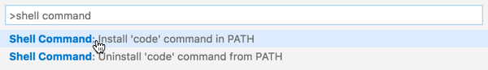
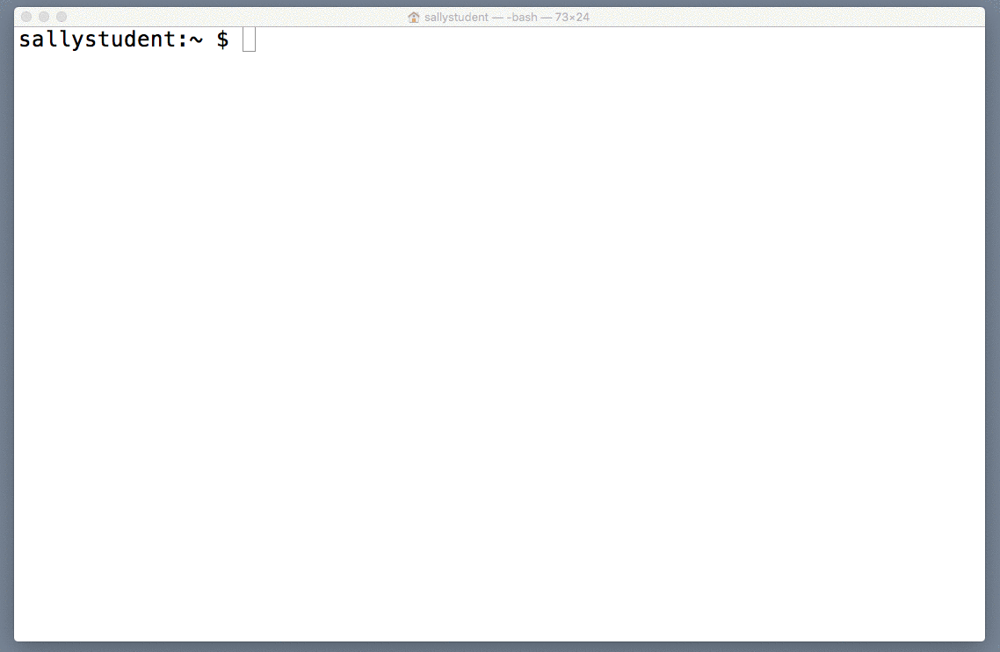
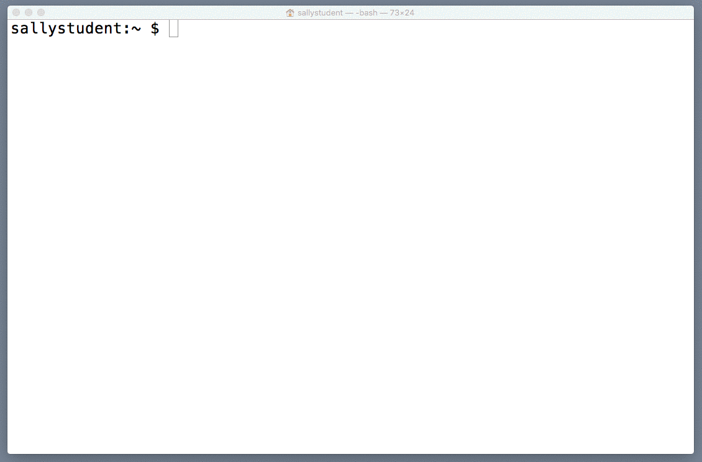
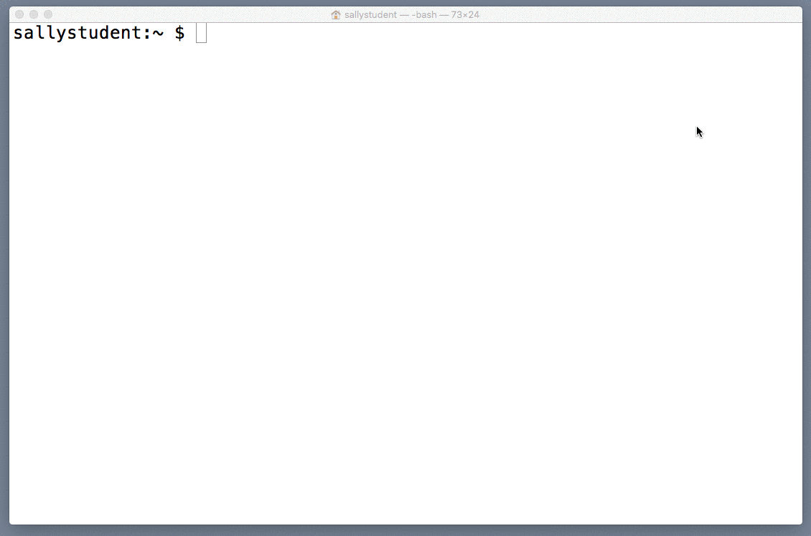
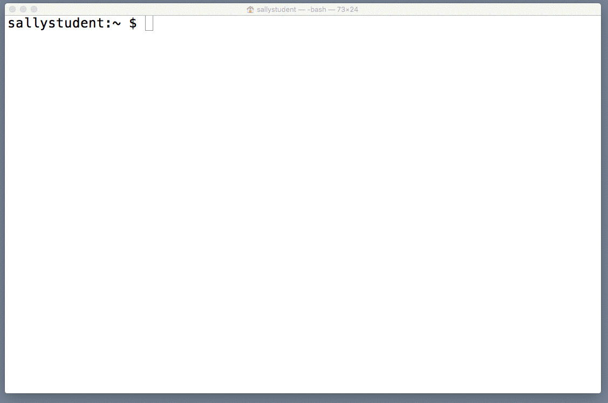
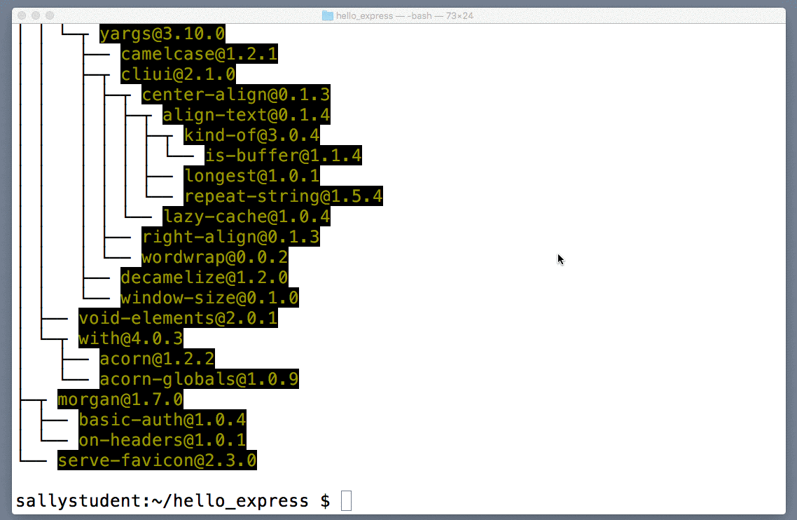

In this reading we'll guide you through setting up your local development environment for Mac. First, we'll walk you through setting up Visual Studio Code, which is the text editor we recommend using for this course.

After that we'll install [Homebrew](http://brew.sh/) which is a package manager that we'll use to install Node and Git (and, later in this course, databases). We'll install and configure Git, and then Node and NPM.


### Set up Visual Studio Code


If you don't already have it installed, [download and install Visual Studio Code](https://code.visualstudio.com/). If you prefer a different text editor, that's fine, but configuration will be up to you.

Typically when you start a new coding session, you'll `cd` into your project directory from terminal and open your project in your editor by running `code .`. In order to run VS Code from the terminal you'll need to add `code` to your PATH. Open the Command Palette (&#8679; &#8984; P) and type `shell command`. 



This will add an alias to your `/usr/local/bin` directory which points to the Visual Studio code executable. To confirm that the command works correctly. Open your Terminal and run `code ~/Desktop`. If it is configured correctly, Visual Studio Code will open your desktop folder.


### Set up Homebrew

Next up we're going to install [Homebrew](http://brew.sh/), which is a package manager for Mac that we'll use to install Node and Git (and later in this course, to install databases like Mongo).

From the command line, run the command:

```
/usr/bin/ruby -e "$(curl -fsSL https://raw.githubusercontent.com/Homebrew/install/master/install)"
```

It may take a few minutes for Homebrew to install. Once installation completes, have a look at the last few lines of output to see if Homebrew has any next steps for you (such as adding environment variables to the path). You can also run `brew doctor` to confirm that Homebrew is set up correctly.


### Set up Git

If you already have Git set up on your Mac and you have a GitHub account, then skip these steps.

If you don't already have an account, [sign up for GitHub](https://github.com/join?source=header-home) (choosing the "Unlimited public repositories for free" option).

Next, from the command line, run `brew install git`. Depending on your internet speed, it may take a few minutes for Git to install.



After Git installs, run `git --version` to confirm everything installed correctly. You should see something like `git version 2.7.4`.

Now from the same Terminal window, run `git config --global user.name "Sally Student"` (substituting your user name), and then `git config --global user.email "sallystudent2017@gmail.com"` (substituting your email address).



With that, you've got Git configured.


### Set up Node and NPM

It's time to install Node by running `brew install node`, which will install the current version of Node (6.7.0 at time of writing).



After the installation completes, run the commands `node --version` and `npm --version` to confirm that both installed correctly.

Let's confirm that we can run a Node application in this environment. Inside of Terminal, move into your home directory if you're not already there by running `cd ~`. Next, create a folder called `hello_node` by running the command: `mkdir hello_node`. `cd` into `hello_node`.

Let's create a simple Node application. Run this command: `echo "console.log('hello world');" > hello.js`.  This will create a new file (`./hello_node/hello.js`) with a single `console.log('hello world');` command in it (you can confirm this by running `cat hello_node/hello.js`


Now run `node hello.js`. You should see the message "hello world" printed to the Terminal.

This means we've got Node running. `cd` back into your home folder (`cd ~`) and delete the folder we just created (`rm -r hello_node`).

###### Be careful with this command; it will delete an entire folder without confirmation. Experienced users often add a confirmation prompt to this command as a safeguard against errors.

Before moving on, let's confirm that we can get an Express app running locally.

To do that we're first going to install [Express generator](https://www.npmjs.com/package/express-generator), which is a third-party package that allows us to quickly bootstrap a new Express project.

Run the command `npm install -g express-generator`, which will install this package globally. Once Express Generator has installed, use it to create a new app. From your home directory in Bash, run the command `express hello_express` to create a new project called "hello_express".



When this command completes, you'll have a new project folder with a basic Express app.

In order to run our app, we next need to install its dependencies. Run `cd hello_express` to move into our new project, and then run `npm install` to install the dependencies listed in `package.json` (which we'll learn about later in this lesson).

Depending on your connection speed, it may take a minute or two for the dependencies to install. Once installation completes, run `npm start` to start your app. Then, visit `localhost:3000` in a browser. You should see "Welcome to express" in the page that loads. Back in Bash, you should see a log entry indicating that a GET request was made to your server.




To stop the server, run `Ctrl-c` (which you may have to do twice).

`cd` up one level, and remove `hello_express` (`cd .. && rm -r hello_express`), as we won't be using this folder again.

Congrats! You're all set to locally develop Node/Express apps.

